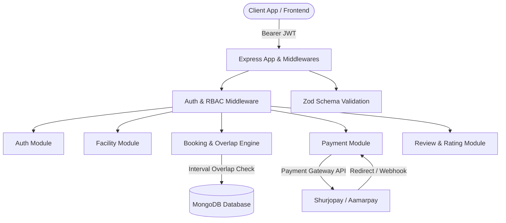

# 🏟️ Facility & Court Booking System - Backend API

[](https://nodejs.org/)
[](https://expressjs.com/)
[](https://www.typescriptlang.org/)
[](https://mongoosejs.com/)
[](https://www.docker.com/)

A production-grade REST API backend for a sports facility and court booking management system. Features modular architecture, strictly typed schemas, automated slot interval overlap prevention, multi-gateway payment processing, and role-based access control.

---

## 🏗️ System Architecture & Workflow



---

## 🌟 Key Engineering Features

- **🛡️ Flawless Interval Overlap Prevention:** mathematically proven boundary algorithm (`startA < endB && endA > startB`) preventing double-booking across partial, identical, or encompassing reservations.
- **🔐 Robust Auth & RBAC:** Dual-token rotation system (short-lived access tokens + secure refresh tokens) with guarded `isModified('password')` pre-save hooks.
- **💳 Multi-Gateway Payment Lifecycle:** Seamless initiation, webhook callback verification, automatic transaction recording, and receipt status generation.
- **⭐ Community Reviews & Ratings:** Aggregate rating calculations and verified feedback endpoints.
- **🔍 Advanced Query Builder:** Dynamic search, multi-field filtering, price sorting, and cursor-friendly pagination.
- **🐳 Containerized & Cloud-Ready:** Multi-stage Dockerfile and Docker Compose orchestration.
- **🧪 Unit Tested:** Comprehensive Jest suite validating interval intersection edge cases.

---

## 📋 API Endpoints

### 🔐 Authentication (`/api/auth`)
| Method | Endpoint | Access | Description |
| :--- | :--- | :--- | :--- |
| `POST` | `/api/auth/signup` | Public | Register a new user |
| `POST` | `/api/auth/login` | Public | Login & receive access/refresh tokens |
| `POST` | `/api/auth/refresh-token` | Public | Generate new access token via refresh token |

### 🏟️ Facilities (`/api/facility`)
| Method | Endpoint | Access | Description |
| :--- | :--- | :--- | :--- |
| `POST` | `/api/facility` | Admin | Create a new sports facility |
| `GET` | `/api/facility` | Public | Get all facilities (search, filter, sort, paginate) |
| `GET` | `/api/facility/:id` | Public | Get single facility details |
| `PUT` | `/api/facility/:id` | Admin | Update facility information |
| `DELETE`| `/api/facility/:id` | Admin | Soft-delete a facility |

### 📅 Bookings & Availability (`/api/bookings` & `/api/check-availability`)
| Method | Endpoint | Access | Description |
| :--- | :--- | :--- | :--- |
| `GET` | `/api/check-availability` | Public | Query non-conflicting available slot windows |
| `POST` | `/api/bookings` | User | Create a booking & initiate payment session |
| `GET` | `/api/bookings` | Admin | View all system-wide bookings |
| `GET` | `/api/bookings/user` | User | View logged-in user's bookings |
| `DELETE`| `/api/bookings/:id` | User | Cancel an existing booking |

### 💳 Payments (`/api/payment`)
| Method | Endpoint | Access | Description |
| :--- | :--- | :--- | :--- |
| `POST/GET`| `/api/payment/confirmation`| Public | Payment gateway verification callback |
| `GET` | `/api/payment/verify/:transactionId` | Public | Retrieve verified booking transaction receipt |

### ⭐ Reviews (`/api/reviews`)
| Method | Endpoint | Access | Description |
| :--- | :--- | :--- | :--- |
| `POST` | `/api/reviews` | User | Post a rating and review comment |
| `GET` | `/api/reviews/:facilityId` | Public | Fetch facility reviews & average rating |

---

## ⚙️ Environment Variables

Create a `.env` file in the root directory:

```env
NODE_ENV=development
PORT=5000
DATABASE_URL=mongodb://localhost:27017/facility-booking
BCRYPT_SALT_ROUNDS=12
JWT_ACCESS_SECRET=your_jwt_access_secret
JWT_REFRESH_SECRET=your_jwt_refresh_secret
JWT_ACCESS_EXPIRES_IN=1d
JWT_REFRESH_EXPIRES_IN=30d
BACKEND_BASE_URL=http://localhost:5000
CLIENT_BASE_URL=http://localhost:5173

# Payment Gateway Credentials
STORE_ID=your_store_id
SIGNATURE_KEY=your_signature_key
PAYMENT_URL=https://sandbox.aamarpay.com/jsonpost.php
VERIFY_PAYMENT_URL=https://sandbox.aamarpay.com/api/v1/trxcheck/request.php
```

---

## 🚀 Getting Started

### 1. Local Setup
```bash
# Install dependencies
npm install

# Run in development mode
npm run start:dev

# Build TypeScript
npm run build

# Run Unit Tests
npm test
```

### 2. Docker Setup
```bash
# Build and run with Docker Compose
docker-compose up -d --build
```
